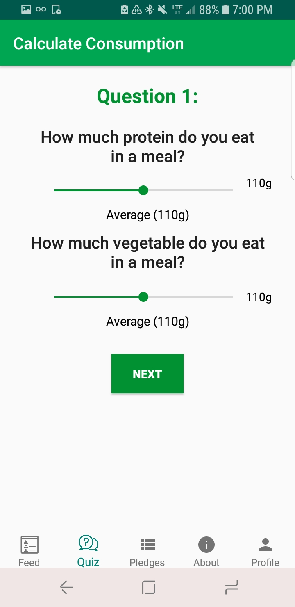
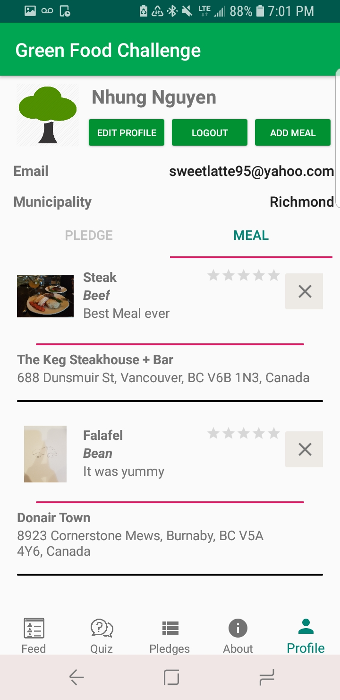

<h3>Main Page</h3>

    The landing page of the application.
    The user is able to start the quiz or see the pledge summary.

<h3>Quiz</h3>

    Contains multiple activities and shows the result of the quizzes.
    First Quiz:
        - User inputs their diet into the application.
    Second Quiz:
        - Allows users to modify their diet and pick an unique diet plan

<h3>User Profile</h3>

    Allows the logged in user to see their pledge and information about their account.

<h3>Pledge Summary</h3>

    Able to see their own pledge and how they compete with other pledges in the Metro Vancouver Area.

